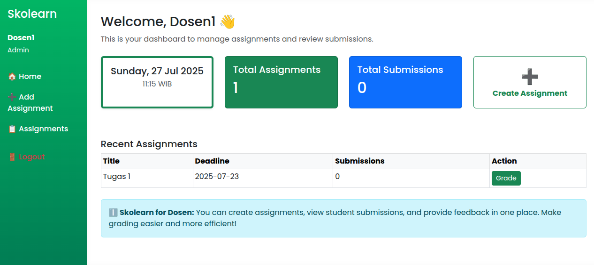
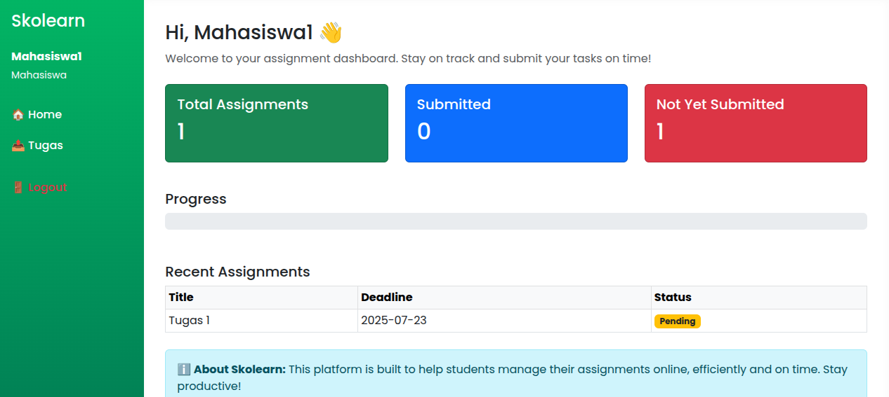

# skolearn v1.0.0
# 🎓 Skolearn — Sistem Pengelolaan Tugas Mahasiswa Berbasis Web

[🌐 Website Live Demo](https://skolearn.free.nf/) • [📁 Lihat di GitHub](https://github.com/ImNizamudin/skolearn)

Skolearn adalah aplikasi web berbasis PHP Native yang membantu dosen dan mahasiswa dalam proses manajemen tugas kuliah. Sistem ini menyediakan alur login terpisah berdasarkan peran pengguna (dosen atau mahasiswa), fitur pembuatan tugas oleh dosen, pengumpulan tugas oleh mahasiswa, serta penilaian dan feedback oleh dosen.

---

## 🚀 Fitur Utama

### 🔐 1. Login Role-Based
- Form login di `login.php`
- Otentikasi berdasarkan username dan password
- Redirect otomatis berdasarkan role:
  - **Dosen/Admin** → `dashboard/dosen.php`
  - **Mahasiswa** → `dashboard/mahasiswa.php`

---

### 👨‍🏫 2. Alur Dosen (Admin)

#### 📊 Dashboard Dosen
- Statistik: jumlah tugas, jumlah kiriman, tanggal hari ini

#### ➕ Buat Tugas
- Input judul, deskripsi, dan deadline
- Data disimpan ke tabel `assignments`

#### 📋 Daftar Tugas
- Lihat semua tugas
- Aksi: Edit / Hapus / Lihat Kiriman Mahasiswa

#### 📝 Penilaian
- Lihat daftar mahasiswa yang telah submit
- Fitur:
  - Melihat file tugas
  - Memberikan nilai dan komentar

---

### 🎓 3. Alur Mahasiswa

#### 🏠 Dashboard Mahasiswa
- Statistik: jumlah tugas, progress bar, info personal

#### 📥 Lihat & Kerjakan Tugas
- Tugas ditampilkan secara daftar
- Klik tugas untuk melihat detail

#### 📤 Kirim atau Edit Tugas
- Upload file & komentar
- Edit kiriman jika sebelumnya sudah pernah submit

#### 🧾 Lihat Nilai
- Lihat nilai & komentar dari dosen

---

## 🗂️ Struktur Database (Simplified)

| Tabel         | Kolom Utama                             | Relasi                                   |
|---------------|------------------------------------------|------------------------------------------|
| `users`       | `id`, `username`, `password`, `role`     | dosen → `assignments`<br>mahasiswa → `submissions` |
| `assignments` | `id`, `title`, `description`, `deadline`, `created_by` | satu assignment → banyak `submissions`  |
| `submissions` | `id`, `user_id`, `assignment_id`, `file`, `nilai`, `komentar` | kiriman tugas mahasiswa                |

---

## 🔁 Alur Sistem (Flow Diagram)

```
[Login]
   ↓
[Role: Dosen] ----------------→ [Dashboard Dosen]
   ↓
[Create / View / Edit Tugas]
   ↓
[Lihat Kiriman Mahasiswa]
   ↓
[Nilai & Komentar Kiriman]

[Role: Mahasiswa] ------------→ [Dashboard Mahasiswa]
   ↓
[Lihat & Kerjakan Tugas]
   ↓
[Kirim atau Edit Kiriman]
   ↓
[Lihat Nilai & Feedback]
```

---

## 🛠️ Teknologi yang Digunakan

- PHP Native (tanpa framework)
- MySQL (Relational Database)
- HTML/CSS + Bootstrap (UI)
- XAMPP / Apache (Web Server)
- File Upload Handling
- Session-based Authentication

---

## 📁 Struktur Folder (Simplified)

```
📦 skolearn/
├── login.php
├── register.php
├── dashboard/
│   ├── dosen.php
│   └── mahasiswa.php
├── tugas/
│   ├── buat.php
│   ├── edit.php
│   └── kirim.php
├── penilaian/
│   └── nilai.php
├── assets/
│   ├── css/
│   ├── js/
│   └── uploads/
├── config/
│   └── db.php
└── logout.php
```

---

## 📌 Tujuan Proyek

Proyek ini dikembangkan sebagai latihan manajemen sistem akademik berbasis web menggunakan pendekatan *role-based access control*, serta untuk mendemonstrasikan pemahaman terhadap CRUD, autentikasi, dan relasi database dalam PHP Native.

---

## 🙋‍♂️ Kontribusi & Lisensi

Proyek ini bersifat open-source dan dapat digunakan untuk pembelajaran. Pull request dan feedback sangat diterima.

**Author**: [Nizamudin](https://github.com/ImNizamudin)  
**Lisensi**: MIT

---

## 📷 Tangkapan Layar (Opsional)

> 
> !Login Page](./assets/img/login-page.png)
> 
> 
